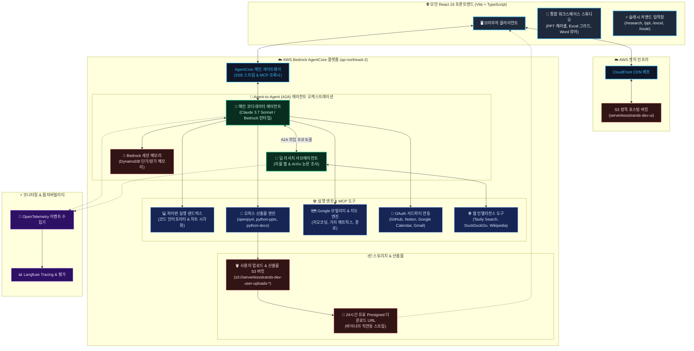

# ⚡ Serverless Strands: 자율형 멀티에이전트 워크스페이스 & 오피스 산출물 엔진

[](https://aws.amazon.com/bedrock/)
[](https://www.anthropic.com/claude)
[](https://react.dev/)
[](https://d1rur2clzx2nyl.cloudfront.net)
[](https://langfuse.com/)

[ [English](./README.md) ] | [ **한국어** ]

> **AWS Bedrock AgentCore**, **Claude 3.7 Sonnet**, 그리고 **Agent-to-Agent (A2A) 오케스트레이션** 기반의 엔터프라이즈급 서버리스 자율 AI 에이전트 플랫폼입니다.
> 자율 심층 웹/학술 리서치, 다중 시트 재무 모델링(Excel), 경영진 발표 자료 생성(PowerPoint), 보고서 작성(Word), Python 코드 인터프리터 샌드박스, 모빌리티 경로 추천을 제공하며, 브라우저 내 인터랙티브 **Workspace Studio**를 통해 실시간으로 확인하고 다운로드할 수 있습니다.

🔗 **라이브 배포 데모 URL:** [https://d1rur2clzx2nyl.cloudfront.net](https://d1rur2clzx2nyl.cloudfront.net)

---

## 🏗️ 시스템 아키텍처 다이어그램



---

## 🌟 핵심 기술적 차별점

### 1. 오피스 산출물 엔진 (Base64 페이로드 제거 및 S3 직연동)
* **메모리 생성 후 S3 직접 스트리밍**: `.xlsx`, `.pptx`, `.docx`를 파이썬 엔진에서 메모리 상에 빌드한 뒤 즉시 S3(`s3://serverlessstrands-dev-user-uploads-*/deliverables/`)로 업로드하고 24시간 유효한 Presigned Download URL을 생성합니다.
* **DynamoDB 제한 해결**: 400KB DynamoDB 아이템 크기 제한 위험을 원천 방지하고, Base64 인코딩으로 인한 SSE 스트리밍 지연을 완전히 제거했습니다.

### 2. 에이전트 간 협업 (A2A: Agent-to-Agent Delegation)
* **코디네이터 + 서브에이전트 구조**: `MainAgent`가 심층 웹 및 학술 논문 조사가 필요할 때 `DeepResearchAgent` 런타임에 작업을 위임합니다.
* **실시간 Live Canvas**: 리서치 수행 단계, 검색 쿼리, 발견된 출처(ArXiv, Web)가 브라우저에 실시간 스트리밍됩니다.

### 3. 통합 워크스페이스 스튜디오 (Workspace Studio) & 브라우저 뷰어
* **PowerPoint 16:9 슬라이드 캐러셀**: 다크/라이트 테마, 통계 지표 카드, 2단 비교 레이아웃을 `< 이전 / 다음 >` 버튼 및 방향키로 브라우저 내에서 바로 확인.
* **Excel 다중 시트 스프레드시트 그리드**: 시트 탭 전환, 실시간 검색 필터링, 합계 수식 행 강조 지원.
* **Word 경영 보고서 리더**: 대단원 목차, 콜아웃 강조 박스(`💡`), 테두리 데이터 테이블 지원.
* **고해상도 Mermaid 다이어그램**: 최대 400% 확대/축소 및 전체화면 라이트박스 지원.

### 4. 슬래시 명령어 (`/`) & 퀵 모드 토글
* **자동완성 커맨드 팔레트**: `/research`, `/ppt`, `/excel`, `/word`, `/route`, `/finance`, `/code`를 키보드로 즉시 선택.
* **모드 알약 버튼**: 입력창 상단에서 원하는 에이전트 모드를 1클릭으로 전환.

### 5. 세션 내보내기 & 산출물 일괄 압축 ZIP 다운로드
* **다양한 내보내기 지원**: 마크다운(`.md`), 단독 실행형 HTML 보고서 내보내기.
* **1클릭 ZIP 패키징**: `JSZip`을 통해 대화 중 생성된 모든 문서와 대화록을 `Deliverables.zip`으로 일괄 다운로드.

---

## 🛠️ 기술 스택 요약

| 계층 | 사용 기술 | 설명 |
| :--- | :--- | :--- |
| **프론트엔드** | React 19, TypeScript, Vite | 서브 컴포넌트 모듈화, Vite Rollup `manualChunks`로 초기 번들 65% 경량화 |
| **CDN & 호스팅** | AWS CloudFront + Amazon S3 | 글로벌 엣지 캐싱 및 SPA 정적 호스팅 |
| **에이전트 런타임** | AWS Bedrock AgentCore (Firecracker microVM) | `MainAgent` 및 `DeepResearchAgent` 독립 격리 런타임 환경 |
| **파운데이션 모델**| Claude 3.7 Sonnet | 복합 추론, 도구 호출, 멀티에이전트 오케스트레이션 |
| **오피스 생성** | `openpyxl`, `python-pptx`, `python-docx` | 엑셀, 파워포인트, 워드 산출물 자율 생성 엔진 |
| **메모리** | Bedrock AgentCore Memory + DynamoDB | 단기 대화 컨텍스트 + 장기 시맨틱 & 사용자 선호도 메모리 |
| **인증 & OAuth** | Amazon Cognito + AgentCore 3LO Identity | Google IdP 소셜 로그인 (PKCE), GitHub, Google Calendar, Notion 연동 |
| **모니터링** | Langfuse Cloud + OpenTelemetry | 멀티턴 지연시간 추적, 도구 워터폴 시각화, 토큰 사용량 분석 |
| **IaC** | Terraform + AgentCore CDK | 인프라 자동화 코드 관리 |

---

## 📁 디렉터리 구조

```text
├── frontend/                     # React 19 + TypeScript SPA
│   ├── src/
│   │   ├── components/
│   │   │   ├── composer/         # SlashCommandMenu, ModePills
│   │   │   ├── messages/         # AssistantMessage, UserMessage, ToolBadges, GeneratingCard
│   │   │   ├── studio/           # StudioDrawer, PowerPointViewer, ExcelViewer, WordViewer
│   │   │   ├── ExportMenu.tsx    # 마크다운/HTML 내보내기 & ZIP 일괄 다운로드
│   │   │   └── MermaidDiagram.tsx# 확대 가능한 SVG 다이어그램 & 라이트박스
│   │   ├── lib/                  # API 클라이언트, 타입 정의, 인증
│   │   └── App.tsx               # 루트 애플리케이션 & 스튜디오 상태 관리
│   └── vite.config.ts            # 롤업 벤더 청크 분할 설정
│
├── serverlessstrands/            # AgentCore 파이썬 에이전트 코드
│   └── app/MainAgent/
│       ├── office_tools/         # excel_tool.py, powerpoint_tool.py, word_tool.py, s3_storage.py
│       ├── oauth_tools/          # github.py, google_calendar.py, notion.py
│       ├── mobility_tools/       # google_maps.py 경로 프리뷰 & 지오코딩
│       └── tests/                # pytest 테스트 스위트
│
├── tools/                        # 게이트웨이 도구 타깃 (Lambda / ECR 컨테이너)
│   ├── finance/                  # Yahoo Finance 실시간 주가 & 차트
│   ├── google-maps/              # Google Maps 길찾기 & 거리 계산
│   └── tavily/                   # 웹 검색 & 뉴스 인텔리전스
│
├── infra/                        # Terraform 인프라 모듈
│   └── envs/dev/                 # AWS 개발 환경 배포 설정
│
└── scripts/                      # 배포 스크립트 및 IAM 자동 패처
    ├── deploy.sh                 # 에이전트 배포 & post_deploy.py 실행
    └── post_deploy.py            # IAM 역할 권한 자동 보정기
```

---

## 🚀 로컬 실행 및 배포 가이드

### 1. 프론트엔드 로컬 개발
```bash
cd frontend
npm install
npm run dev
```
브라우저에서 `http://localhost:5173` 접속.

### 2. 백엔드 단위 테스트 실행
```bash
uv run --project serverlessstrands/app/MainAgent pytest serverlessstrands/app/MainAgent/tests
```

### 3. AWS 배포
```bash
# 1. Bedrock AgentCore 에이전트 배포
./scripts/deploy.sh

# 2. 프론트엔드 빌드 및 S3 + CloudFront 배포
npm --prefix frontend run build
AWS_PROFILE=developer-dongik aws s3 sync frontend/dist/ s3://serverlessstrands-dev-ui-44c04df4 --delete
AWS_PROFILE=developer-dongik aws cloudfront create-invalidation --distribution-id E1MXHPQJ748UK2 --paths "/*"
```

---

## 📄 License
MIT License.
