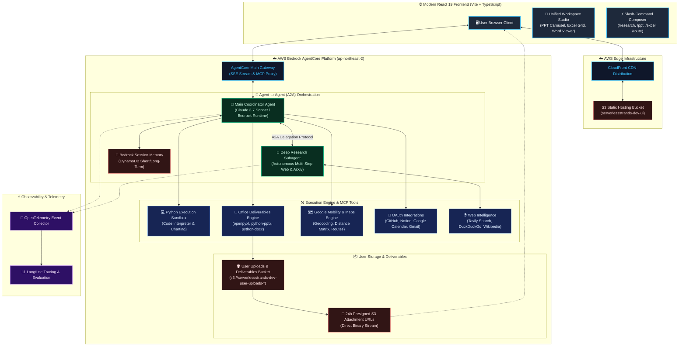

# ⚡ Serverless Strands: Autonomous Multi-Agent Workspace & Office Deliverables Engine

[](https://aws.amazon.com/bedrock/)
[](https://www.anthropic.com/claude)
[](https://react.dev/)
[](https://d1rur2clzx2nyl.cloudfront.net)
[](https://langfuse.com/)

[ **English** ] | [ [한국어 (Korean)](./README.ko.md) ]

---

> An enterprise-grade, serverless autonomous AI agent platform powered by **AWS Bedrock AgentCore**, **Claude 3.7 Sonnet**, and **Agent-to-Agent (A2A) orchestration**. 
> Capable of autonomous deep web & academic research, multi-sheet financial modeling (Excel), executive presentation generation (PowerPoint), document synthesis (Word), Python computational sandboxes, and mobility routing—all paired with a high-performance in-browser **Workspace Studio**.

🔗 **Live Production URL:** [https://d1rur2clzx2nyl.cloudfront.net](https://d1rur2clzx2nyl.cloudfront.net)

---

## 🏗️ System Architecture



---

## 🌟 Core Technical Highlights

### 1. Autonomous Office Deliverables Engine (Zero Base64 Bloat)
* **Direct S3 Upload & 24h Presigned Download URLs**: When generating `.xlsx`, `.pptx`, or `.docx` files, the Python engine compiles binaries in-memory, streams directly to S3 (`s3://serverlessstrands-dev-user-uploads-*/deliverables/`), and issues secure 24-hour presigned attachment URLs.
* **Solves DynamoDB Limits**: Completely eliminates the risk of exceeding the DynamoDB 400KB item size limit and eliminates SSE streaming latency overhead.

### 2. Multi-Agent Agent-to-Agent (A2A) Delegation
* **Coordinator + Subagent Pipeline**: The `MainAgent` transparently delegates complex investigation tasks to a specialized `DeepResearchAgent` runtime over MCP/SSE.
* **Real-time Live Canvas**: Live streaming trace of research steps, search queries, and academic papers (ArXiv / Web) viewed side-by-side in the chat.

### 3. Unified Workspace Studio & In-Browser Document Previews
* **PowerPoint 16:9 Slide Carousel**: Browse through dark/light theme slides with `< Previous / Next >`, stat cards, and two-column benchmarks directly in the browser.
* **Excel Multi-Sheet Spreadsheet Grid**: Switch sheets, view styled zebra rows, filter rows with real-time keyword search, and highlight summary total formulas.
* **Executive Word Reader**: Dossier view with headings, callouts (`💡`), and bordered tables.
* **High-Res Mermaid Diagram Lightbox**: Diagrams zoomable up to 400% with fullscreen lightbox.

### 4. Slash-Commands (`/`) & Quick Mode Toggles
* **Interactive Command Palette**: Type `/` to access `/research`, `/ppt`, `/excel`, `/word`, `/route`, `/finance`, `/code` with full arrow-key keyboard navigation.
* **Mode Pills**: One-click switching to specialized agent workflows with contextual placeholder guidance.

### 5. Session Portability & 1-Click Deliverables ZIP
* **Export Options**: Export any session to Markdown (`.md`), styled HTML reports, or download all generated deliverables and charts in a single bundled `.zip` archive via `jszip`.

---

## 🛠️ Tech Stack & Infrastructure

| Layer | Technology | Purpose / Notes |
| :--- | :--- | :--- |
| **Frontend** | React 19, TypeScript, Vite | Sub-component modularization, 65% bundle reduction via `manualChunks` |
| **Edge & Hosting** | AWS CloudFront + Amazon S3 | Global CDN edge caching & SPA distribution |
| **Agent Runtimes** | AWS Bedrock AgentCore (Firecracker microVMs) | Isolated Python runtime environments for `MainAgent` & `DeepResearchAgent` |
| **Foundational Model** | Claude 3.7 Sonnet (`anthropic.claude-3-7-sonnet-20250219-v1:0`) | Reasoning, function calling, tool orchestration |
| **Office Tooling** | `openpyxl`, `python-pptx`, `python-docx` | Autonomous programmatic creation of spreadsheets, decks, and dossiers |
| **Memory Architecture**| Bedrock AgentCore Memory + Amazon DynamoDB | Short-Term Context + Long-Term Semantic & Preference Memory |
| **Identity & OAuth** | Amazon Cognito + AgentCore 3LO Identity | Google IdP federation with PKCE; GitHub, Google Calendar, Notion integrations |
| **Observability** | Langfuse Cloud + OpenTelemetry | Multi-turn latency tracking, tool waterfall inspection, token analytics |
| **Infrastructure as Code** | Terraform + AgentCore CDK | Declarative reproducible cloud infrastructure |

---

## 📁 Repository Structure

```text
├── frontend/                     # React 19 + TypeScript SPA
│   ├── src/
│   │   ├── components/
│   │   │   ├── composer/         # SlashCommandMenu, ModePills
│   │   │   ├── messages/         # AssistantMessage, UserMessage, ToolBadges, GeneratingCard
│   │   │   ├── studio/           # StudioDrawer, PowerPointViewer, ExcelViewer, WordViewer
│   │   │   ├── ExportMenu.tsx    # Markdown/HTML export & ZIP bundle generator
│   │   │   └── MermaidDiagram.tsx# Zoomable SVG diagram renderer & fullscreen lightbox
│   │   ├── lib/                  # API client, types, auth utilities
│   │   └── App.tsx               # Root application & Studio orchestration
│   └── vite.config.ts            # Dynamic chunk splitting (vendor, markdown, diagrams)
│
├── serverlessstrands/            # AgentCore Python agent definitions
│   └── app/MainAgent/
│       ├── office_tools/         # excel_tool.py, powerpoint_tool.py, word_tool.py, s3_storage.py
│       ├── oauth_tools/          # github.py, google_calendar.py, notion.py
│       ├── mobility_tools/       # google_maps.py route previews & geocoding
│       └── tests/                # pytest test suite for office and A2A tools
│
├── tools/                        # Gateway tool targets (Lambda / ECR containers)
│   ├── finance/                  # Yahoo Finance real-time stock quotes & charts
│   ├── google-maps/              # Google Maps routing & distance matrix
│   └── tavily/                   # Web search & news intelligence
│
├── infra/                        # Terraform infrastructure modules
│   └── envs/dev/                 # AWS dev environment configuration
│
└── scripts/                      # Deployment scripts & IAM fixup automations
    ├── deploy.sh                 # Full agent deploy & post-deploy IAM patcher
    └── post_deploy.py            # Idempotent IAM role policy synthesizer
```

---

## 🚀 Quickstart & Local Development

### Prerequisites
- Node.js 22+ & npm
- Python 3.12+ with `uv`
- AWS CLI configured with appropriate permissions

### 1. Frontend Development
```bash
cd frontend
npm install
npm run dev
```
Open `http://localhost:5173` to test the UI locally.

### 2. Run Backend Unit Tests
```bash
uv run --project serverlessstrands/app/MainAgent pytest serverlessstrands/app/MainAgent/tests
```

### 3. Deploy to AWS
```bash
# Deploy Bedrock AgentCore agents
./scripts/deploy.sh

# Build & Deploy Frontend to S3 + CloudFront
npm --prefix frontend run build
AWS_PROFILE=your-profile aws s3 sync frontend/dist/ s3://<UI_BUCKET> --delete
AWS_PROFILE=your-profile aws cloudfront create-invalidation --distribution-id <DIST_ID> --paths "/*"
```

---

## 📄 License
MIT License.
